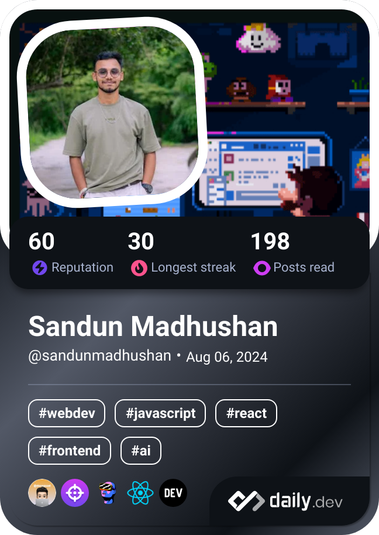

<h1 align="left">
  Hi there, I'm <a href="https://sandunmadhushan.github.io/">Sandun Madhushan </a>
  
</h1>

- 🎓 Currently learning Software Engineering  
- 💻 Working as a freelance Web Developer and Designer
- 🔥 Working with modern web technologies and frameworks
- 🌐 Specialized in creating responsive and user-friendly websites
- ⚡ &nbsp;&nbsp;Experienced in both frontend and backend development
- 📱 Passionate about creating seamless user experiences

 

    
    &nbsp;
    

  <b>Note:</b> Top languages are metrics of my public code and do not reflect skill level.

<!-- 
 -->
  
<!--   -->

<!--<picture>
        <source media="(prefers-color-scheme: dark)" srcset="https://streak-stats.demolab.com?user=sandunMadhushan&theme=algolia">
        <source media="(prefers-color-scheme: light)" srcset="https://streak-stats.demolab.com?user=sandunMadhushan&theme=default">
        
</picture> -->

<!--  -->

<!--
-->

## 🌐 Connect with me

  
  
  

 

  
  

  

